 

  

  

## 💠 Sobre mim

Analista de Sistemas focado em **backend, APIs e integrações**. Meu trabalho gira em torno de uma ideia simples: **entregar serviços estáveis, com código bem mantido e previsível**. O tipo de serviço que roda em produção sem surpresa.

No dia a dia transito entre **desenvolvimento em Python** e a **sustentação de plataformas corporativas de larga escala** (ecossistema **Salesforce/SOLAR**), onde diagnóstico de logs, *troubleshooting* de integrações e **observabilidade** (logs, métricas e alertas) fazem parte da rotina. Gosto de problemas que exigem entender o sistema de ponta a ponta, encontrar a causa raiz e documentar a solução com clareza.

📍 São Paulo, Brasil · 🗣️ Português (nativo) e Inglês (fluente)

## ⚡ O que eu faço bem

- **APIs e backend em Python** · serviços REST com **FastAPI**, autenticação **OAuth2/JWT**, persistência com **SQLAlchemy** e programação **assíncrona/concorrente** quando o ganho justifica.
- **Integrações confiáveis** · consumo e exposição de APIs, integração com ferramentas de fluxo (ex.: **JIRA**), com atenção a contratos, idempotência e consistência de dados.
- **Qualidade e entrega contínua** · **Pytest**, **CI/CD com GitHub Actions**, versionamento disciplinado e revisões via **Git/GitHub**.
- **Diagnóstico e observabilidade** · investigação de logs, análise de causa raiz e melhoria de visibilidade dos serviços em ambientes corporativos críticos.
- **Dados** · modelagem e consultas em **MySQL** e **MongoDB**.
- **Apoio no front quando preciso** · base sólida em **JavaScript/TypeScript**, **HTML/CSS** e **React** para colaborar de ponta a ponta.

## 🧬 Stack & Ferramentas

  

`Python` · `FastAPI` · `SQLAlchemy` · `OAuth2/JWT` · `Pytest` · `Docker` · `CI/CD` · `MySQL` · `MongoDB` · `REST` · `Git/GitHub` · `Linux`

## 🛰️ Experiência

**Analista de Sistemas · Claro Brasil** · *out/2025 → atual*
- Atuação em **backend, APIs e integrações** no ecossistema **Salesforce/SOLAR**.
- Sustentação e evolução de serviços, **troubleshooting** e investigação de causa raiz a partir de logs.
- Melhorias de **observabilidade** (logs, métricas e alertas) para aumentar a confiabilidade da plataforma.

**Desenvolvedor Backend · Freelancer** · *jan/2023 → atual*
- Desenvolvimento de APIs e ferramentas em **Python**, integrações com serviços externos e entregas versionadas.

**Analista de Sistemas · Polícia Civil (DIPOL/DTI)** · *ago/2025 → out/2025*
- Suporte e análise de sistemas no contexto de tecnologia da informação do órgão.

**Digitador · PRODESP** · *mai/2024 → jul/2025*
- Tratamento e estruturação de dados com precisão e consistência.

## 🗂️ Projetos em destaque

| Projeto | Descrição | Stack |
| :--- | :--- | :--- |
| **[simple_url_shortener](https://github.com/johncarvalhonx/simple_url_shortener)** | Encurtador de URLs · serviço/API simples. | `Python` |
| **[ProjetoMeteorologico](https://github.com/johncarvalhonx/ProjetoMeteorologico)** | Consumo e exibição de dados meteorológicos via API. | `Python` |
| **[PyEmergia](https://github.com/johncarvalhonx/PyEmergia)** | _(adicione uma breve descrição)_ | `Python` |
| **[Hyper-Cleaner](https://github.com/johncarvalhonx/Hyper-Cleaner)** | Utilitário de limpeza e otimização do sistema. | `Python` |
| **[sustainable-habits-tracker](https://github.com/johncarvalhonx/sustainable-habits-tracker)** | Aplicação para acompanhamento de hábitos sustentáveis. | `Python` |
| **[QuickYT](https://github.com/johncarvalhonx/QuickYT)** | Ferramenta rápida para YouTube. | `Python` |

## 🎓 Formação & Certificações

🎓 **Bacharel em Ciência da Computação** · UNIP, São Paulo *(concluído em 2025)*

**Cursos & certificações (seleção):**
- Programação concorrente e assíncrona em Python · Udemy
- Python do zero ao avançado · Udemy
- React + TypeScript com projetos · Udemy
- Desenvolvimento Fullstack Web (HTML/CSS/JS) · Udemy
- Java & Spring Boot com MySQL/MongoDB · Udemy

## 📡 Atividade no GitHub

  

    

  

## 🤝 Vamos conversar

Estou aberto a oportunidades em **backend, APIs e integrações**. Se faz sentido para o seu time, será um prazer trocar uma ideia.

 

