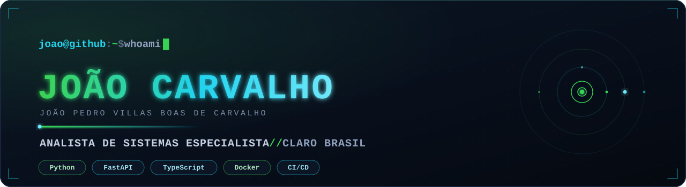

 

 

Analista de Sistemas Especialista na **Claro**, atuando em **backend, APIs e integrações** dentro do ecossistema **Salesforce/SOLAR**.

Meu trabalho é sustentar e evoluir serviços que já rodam em produção: investigação de logs, análise de causa raiz, correção de integrações e instrumentação do que falta de observabilidade. Em paralelo, desenvolvo em **Python** e **TypeScript**, com foco em APIs REST e aplicações desktop.

- **Backend e APIs.** Serviços REST em Python com FastAPI, autenticação OAuth2 e JWT, persistência com SQLAlchemy e execução assíncrona e concorrente.
- **Integrações.** Consumo e exposição de APIs entre sistemas, integração com JIRA, definição de contratos, idempotência e consistência de dados.
- **Qualidade e entrega.** Testes com Pytest, pipelines de CI/CD no GitHub Actions, versionamento e revisão de código em Git.
- **Operação e diagnóstico.** Leitura de logs, análise de causa raiz e instrumentação de logs, métricas e alertas em plataformas de larga escala.
- **Dados.** Modelagem e consultas em MySQL e MongoDB.
- **Interface.** JavaScript, TypeScript, React e HTML/CSS, para atuar de ponta a ponta quando o projeto exige.

  

`Python` · `FastAPI` · `SQLAlchemy` · `OAuth2/JWT` · `Pytest` · `Docker` · `CI/CD` · `MySQL` · `MongoDB` · `REST` · `Git` · `Linux`

**Analista de Sistemas Especialista** · Claro Brasil · *out/2025 até hoje*

- Backend, APIs e integrações no ecossistema Salesforce/SOLAR.
- Sustentação e evolução de serviços em produção, com investigação de causa raiz a partir de logs.
- Instrumentação de logs, métricas e alertas para aumentar a confiabilidade da plataforma.

**Desenvolvedor Backend** · Autônomo · *jan/2023 até hoje*

- APIs e ferramentas em Python, integrações com serviços externos e entregas versionadas.

**Analista de Sistemas** · Polícia Civil, DIPOL/DTI · *ago/2025 a out/2025*

- Suporte e análise dos sistemas internos do órgão.

**Digitador** · PRODESP · *mai/2024 a jul/2025*

- Tratamento e estruturação de dados.

| Projeto | Descrição | Stack |
| :--- | :--- | :--- |
| **[Evo](https://github.com/johncarvalhonx/Evo)** | Painel do PC para um segundo monitor, em tela cheia, com leitura de sensores de hardware em tempo real. | `Tauri` · `Rust` · `React` · `TypeScript` |
| **[Vitra](https://github.com/johncarvalhonx/Vitra)** | Otimizador e limpador para Windows 10 e 11 (x64), com interface própria e instalador. | `Electron` · `React` · `TypeScript` |
| **[Valor.ia](https://github.com/johncarvalhonx/Valor.ia)** | Assistente financeiro local por texto e voz, com painel web, API e persistência em SQLite. | `Python` · `Flask` · `SQLite` |
| **[controledehoras](https://github.com/johncarvalhonx/controledehoras)** | Aplicativo desktop que registra horas extras e calcula o valor a receber e os totais do mês e do ano. | `Python` · `PySide6` · `SQLite` |
| **[ecomonitormobile](https://github.com/johncarvalhonx/ecomonitormobile)** | Monitoramento ambiental: app Android consumindo uma API própria de clima e qualidade do ar. | `Kotlin` · `Python` · `FastAPI` |
| **[sustainable-habits-tracker](https://github.com/johncarvalhonx/sustainable-habits-tracker)** | API REST para acompanhamento de hábitos sustentáveis, com autenticação JWT e resumos periódicos. | `Python` · `FastAPI` · `Docker` |

**Bacharelado em Ciência da Computação** · UNIP, São Paulo · *concluído em 2025*

Certificações complementares:

- Programação concorrente e assíncrona em Python · Udemy
- Python do zero ao avançado · Udemy
- React com TypeScript · Udemy
- Desenvolvimento web fullstack, HTML, CSS e JavaScript · Udemy
- Java e Spring Boot com MySQL e MongoDB · Udemy

Para assuntos profissionais, o LinkedIn e o e-mail abaixo são os canais mais diretos.

&nbsp;&nbsp;

&nbsp;&nbsp;

 

